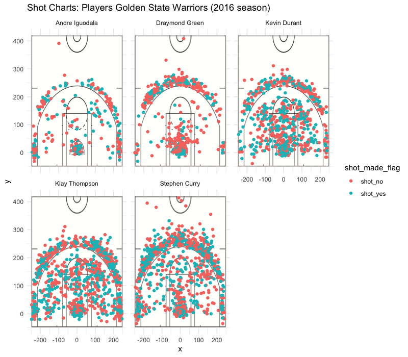

## Introduction
In 2016 the Golden State Warriors was the number one ranked team within the Western Conference of the NBA. With an overall record of 73 wins and only 9 losses, you can see a huge gap between the Golden State Warriors, and their competitors. So the question is what made the Golden State Warriors such a forced to be reckoned with within the Western Conference of the NBA? There are always several factors to keep into account when analyzing the reason behind a teams win; maybe they are receiving good coaching, maybe they have a "Home Court Advantage" for a given game, maybe they have some star players with inherent talent, or possibly its a combination of all of the previous factors. It is impossible to state definitively a reason why  they did so amazing within the 2016 season, but by analyzing some of the statistics of their star players we can potentially see how impressive their athletes are as a result of their intrinsic talent combined with the environmental factors they are put under, such as coaching, and more. From this data we can potentially see who has contributed most towards their excessive winning streak, and therefore draw some conclusions as to the athletes which are responsible to their dominating 73 wins to 9 losses record in 2016.


##Motivation
The motivation behind this report is to dive into  asking how the Golden State Warriors did so well in the Western Conference's 2016 Season. Specifically, five of their star players will be analyzed: Kevin Durant, Andre Iguodala, Klay Thompson, Stephen Curry, and Draymond Green. From an analysis in following sections, we will be able to conclude who is believed to be the most valuable player by  factoring in their shots made, percentage of shots made, and finally factoring in how they contributed to the Golden State Warrior's overall success. 


##Background
The Golden State Warriors are an American Basketball team based in Oakland, CA, and they are known for their extremely impressive record within the NBA's Western Conference. Within this report, we will specifically look at the Golden State Warrior's data for their 2016 season. Moreover, this report will follow the record and effectiveness of five star players within the Golden State Warriors: Kevin Durant, Andre Iguodala, Klay Thompson, Stephen Curry, and Draymond Green. Stephen Curry, one of the star players was selected as an early pick for the Golden State Warriors from the 2009 NBA Draft, and since then has been a forced to be reckoned with and has soared into being one of the most valuable players on the team. Kevin Durant started his career with the Seattle SuperSonics in 2007, and moved into becoming a star player for the Golden State Warriors in 2016. Andre Iguodala furthermore started his career in 2004, and has moved around since then, specifically moving and having a major influence as a player for the Golden State Warriors in 2015. Klay Thompson, on the other hand is more of a rookie compared to the others, being drafted by the warriors in 2011, and becoming a valuable part of the team from there. Last but not least within this group, Draymond Green is the biggest rookie within the group by being picked by the Golden State Warriors within the 2012 NBA Draft. 


##Data

```{r echo=FALSE}
library(dplyr)
daata <- read.csv("../data/shots-data.csv")
```

#####Table 1: Effectiveness of 2 Point Shots by Player
```{r out.width='80%', echo = FALSE, fig.align='center'}
twopt_effective <- arrange(summarise(group_by(daata, name), total = sum(shot_type == "2PT Field Goal"), made = sum(shot_type =='2PT Field Goal' & shot_made_flag == 'shot_yes'), perc_made = made/total),desc(perc_made))
twopt_effective
```

#####Table 2: Effectiveness of 3 Point Shots by Player
```{r out.width='80%', echo = FALSE, fig.align='center'}
threept_effective <- arrange(summarise(group_by(daata, name), total = sum(shot_type == "3PT Field Goal"), made = sum(shot_type =='3PT Field Goal' & shot_made_flag == 'shot_yes'), perc_made = made/total),desc(perc_made))
threept_effective
```

#####Table 3: Effectiveness of Total Shots by Player
```{r out.width='80%', echo = FALSE, fig.align='center'}
effective_shooting_by_player <- arrange(summarise(group_by(daata, name), total = length(shot_type), made = sum(shot_made_flag == 'shot_yes'), perc_made = made/total),desc(perc_made))
effective_shooting_by_player
```


#####Figure 1: Display of Where Shots were Made by Player
```{r out.width='80%', echo = FALSE, fig.align='center'}

```
##Analysis


##Discussion


##Conclusions and Take Home Message


##References
The following is a list of references displayed by URL which was usefull in receiving information for this report:
https://www.basketball-reference.com/teams/GSW/2016_games.html
https://www.nba.com/players/stephen/curry/201939
https://www.nba.com/players/kevin/durant/201142
https://www.nba.com/players/andre/iguodala/2738
https://www.nba.com/players/klay/thompson/202691
https://www.nba.com/players/draymond/green/203110


