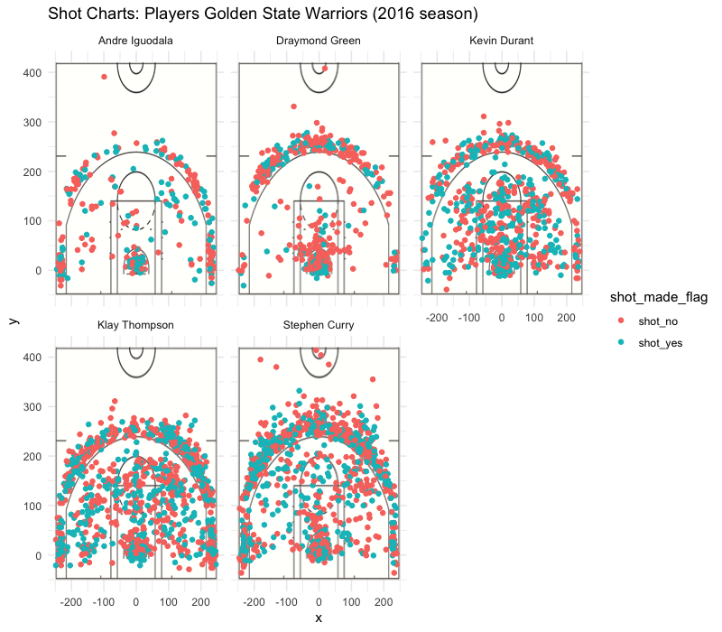

workout01-report
================
Cameron Ostroot
3/13/2019

Introduction
------------

The Golden State Warriors are an American Basketball team based in Oakland, CA, and they are known for their extremely impressive record within the NBA's Western Conference. Within this report, we will specifically look at the Golden State Warrior's data for their 2016 season. In 2016 the Golden State Warriors was the number one ranked team within the Western Conference of the NBA. With an overall record of 73 wins and only 9 losses, you can see a huge gap between the Golden State Warriors, and their competitors. So the question is what made the Golden State Warriors such a forced to be reckoned with within the Western Conference of the NBA? There are always several factors to keep into account when analyzing the reason behind a teams win; maybe they are receiving good coaching, maybe they have a "Home Court Advantage" for a given game, maybe they have some star players with inherent talent, or possibly its a combination of all of the previous factors. It is impossible to state definitively a reason why they did so amazing within the 2016 season, but by analyzing some of the statistics of their star players we can potentially see how impressive their athletes are as a result of their intrinsic talent combined with the environmental factors they are put under, such as coaching, and more. From this data we can potentially see who has contributed most towards their excessive winning streak, and therefore draw some conclusions as to the athletes which are responsible to their dominating 73 wins to 9 losses record in 2016.

Motivation
----------

Background
----------

Data
----

    ## 
    ## Attaching package: 'dplyr'

    ## The following objects are masked from 'package:stats':
    ## 
    ##     filter, lag

    ## The following objects are masked from 'package:base':
    ## 
    ##     intersect, setdiff, setequal, union

##### Effectiveness of 2 Point Shots by Player

    ## # A tibble: 5 x 4
    ##   name           total  made perc_made
    ##   <fct>          <int> <int>     <dbl>
    ## 1 Andre Iguodala   210   134     0.638
    ## 2 Kevin Durant     643   390     0.607
    ## 3 Stephen Curry    563   304     0.540
    ## 4 Klay Thompson    640   329     0.514
    ## 5 Draymond Green   346   171     0.494

##### Effectiveness of 3 Point Shots by Player

    ## # A tibble: 5 x 4
    ##   name           total  made perc_made
    ##   <fct>          <int> <int>     <dbl>
    ## 1 Klay Thompson    580   246     0.424
    ## 2 Stephen Curry    687   280     0.408
    ## 3 Kevin Durant     272   105     0.386
    ## 4 Andre Iguodala   161    58     0.360
    ## 5 Draymond Green   232    74     0.319

##### Effectiveness of Total Shots by Player

    ## # A tibble: 5 x 4
    ##   name           total  made perc_made
    ##   <fct>          <int> <int>     <dbl>
    ## 1 Kevin Durant     915   495     0.541
    ## 2 Andre Iguodala   371   192     0.518
    ## 3 Klay Thompson   1220   575     0.471
    ## 4 Stephen Curry   1250   584     0.467
    ## 5 Draymond Green   578   245     0.424

Analysis
--------

Discussion
----------

Conclusions and Take Home Message
---------------------------------

References
----------

